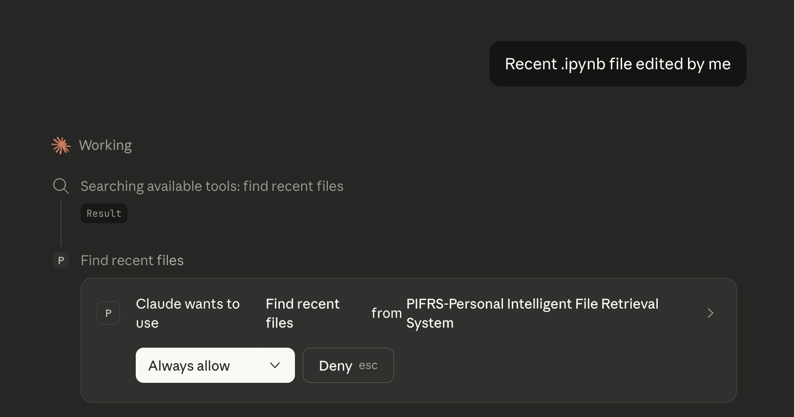
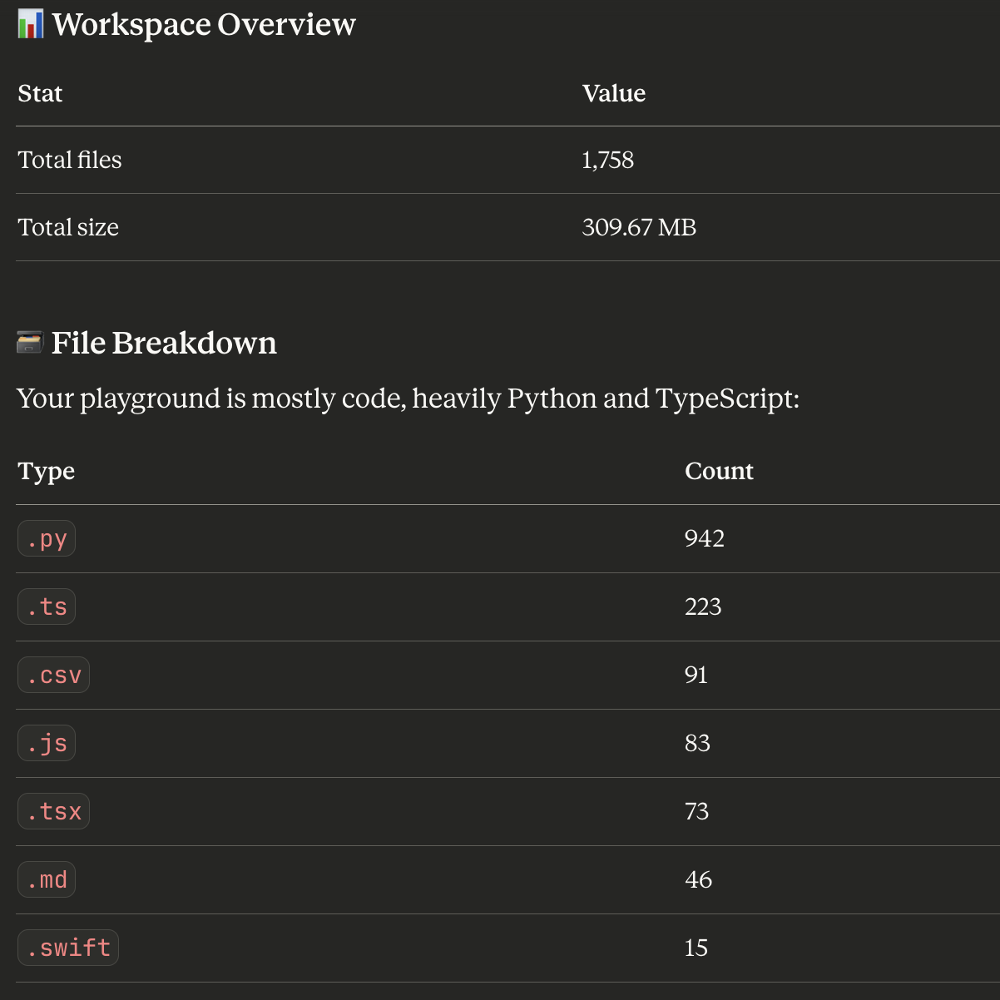
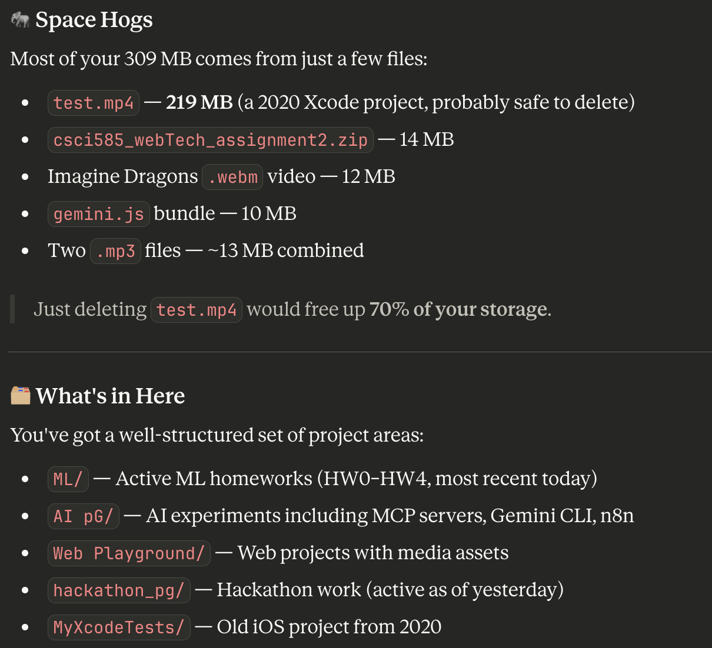

# PIFRS 🧠 | Personal Intelligent File Retrieval System

**PIFRS** is a macOS-optimized custom [Model Context Protocol (MCP)](https://modelcontextprotocol.io) server built to act as a personal file assistant. It focuses on fast, safe file discovery and workspace analysis using timestamp, name, and content–based search.

*Example: Granting Claude permission to use PIFRS tools to find recent .ipynb files.*

---

## Why PIFRS?
Standard AI file access is often slow or risks "hallucinating" file paths. PIFRS solves this by implementing:
* **Breadth-First Search (BFS):** Depth-limited scans to prevent deep-system lag.
* **System Awareness:** Automatically skips `.git`, `node_modules`, and `Library` folders.
* **Safety First:** Strict 10MB limits and MIME-type checks to prevent the LLM from choking on binary data.
* **Performance:** Uses `@lru_cache` for path validation and iterative searching for memory efficiency.

---

## Feature Set

### 1. Intelligence & Analysis
PIFRS doesn't just "find" files; it understands your workspace.
* **Workspace Overview:** Summarizes total size, file counts, and extension breakdowns.
* **Space Hogs:** Identifies the largest/oldest files to help you reclaim storage.
* **Smart Organizer:** Suggests directory structures based on file types.

### 2. Powerful Search & Retrieval
* **Grep-like Content Search:** Filtered by extension, case-insensitivity, and depth.
* **Recent Activity:** Quickly find what you worked on in the last hour or day.
* **Safe Read:** Structured JSON output with size guards and line limits.

*The 'Workspace Overview' tool in action, breaking down language usage and file counts.*

---

## 📊 Visual Insights
PIFRS provides the data; the AI provides the insight. Below is an example of the **Space Hogs** tool identifying large files (like old `.mp4` and `.zip` archives) that are safe to delete.

---

## Technical Stack
* **Language:** Python 3.x
* **Framework:** `fastmcp`
* **Libraries:** `pathlib` (Modern path handling), `mimetypes`, `functools.lru_cache`
* **Integration:** Works with any MCP-compatible client (Claude Desktop, etc.)

---
*Developed by Siddarth Singaravel — focused on building scalable, agentic AI workflows.*